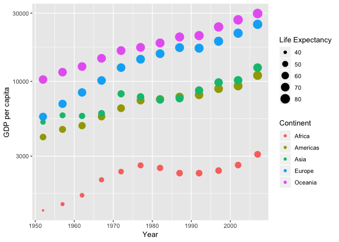

Homework 02: Explore Gapminder and use dplyr
================
Roger Yu-Hsiang Lo
2018-09-20

-   [Bring rectangular data in](#bring-rectangular-data-in)
-   [Smell test the data](#smell-test-the-data)
-   [Explore individual variables](#explore-individual-variables)
-   [Explore variable plot types](#explore-variable-plot-types)
-   [Use `filter()`, `select()` and `%>%`](#use-filter-select-and)
-   [But I want to do (a bit) more!](#but-i-want-to-do-a-bit-more)

Bring rectangular data in
-------------------------

-   Load the `Gapminder` data and `tidyverse` package:

``` r
library(gapminder)
library(tidyverse)
```

-   Some sanity check to make sure the `Gapminder` data was loaded properly:

``` r
head(gapminder) %>%
  knitr::kable(.)
```

| country     | continent |  year|  lifeExp|       pop|  gdpPercap|
|:------------|:----------|-----:|--------:|---------:|----------:|
| Afghanistan | Asia      |  1952|   28.801|   8425333|   779.4453|
| Afghanistan | Asia      |  1957|   30.332|   9240934|   820.8530|
| Afghanistan | Asia      |  1962|   31.997|  10267083|   853.1007|
| Afghanistan | Asia      |  1967|   34.020|  11537966|   836.1971|
| Afghanistan | Asia      |  1972|   36.088|  13079460|   739.9811|
| Afghanistan | Asia      |  1977|   38.438|  14880372|   786.1134|

-   Or we can check the end of the data:

``` r
tail(gapminder) %>%
  knitr::kable(.)
```

| country  | continent |  year|  lifeExp|       pop|  gdpPercap|
|:---------|:----------|-----:|--------:|---------:|----------:|
| Zimbabwe | Africa    |  1982|   60.363|   7636524|   788.8550|
| Zimbabwe | Africa    |  1987|   62.351|   9216418|   706.1573|
| Zimbabwe | Africa    |  1992|   60.377|  10704340|   693.4208|
| Zimbabwe | Africa    |  1997|   46.809|  11404948|   792.4500|
| Zimbabwe | Africa    |  2002|   39.989|  11926563|   672.0386|
| Zimbabwe | Africa    |  2007|   43.487|  12311143|   469.7093|

Smell test the data
-------------------

-   First, we check what data structure the `Gapminder` data belong to:

``` r
typeof(gapminder)
```

    ## [1] "list"

-   We can also check its class:

``` r
class(gapminder)
```

    ## [1] "tbl_df"     "tbl"        "data.frame"

-   Next we see how many variables (i.e., columns) are there in the data:

``` r
ncol(gapminder)
```

    ## [1] 6

-   Similarly, the number of rows indicates the number of observations in the data:

``` r
nrow(gapminder)
```

    ## [1] 1704

-   In fact, we can get all the information above just using the function `str()`:

``` r
str(gapminder)
```

    ## Classes 'tbl_df', 'tbl' and 'data.frame':    1704 obs. of  6 variables:
    ##  $ country  : Factor w/ 142 levels "Afghanistan",..: 1 1 1 1 1 1 1 1 1 1 ...
    ##  $ continent: Factor w/ 5 levels "Africa","Americas",..: 3 3 3 3 3 3 3 3 3 3 ...
    ##  $ year     : int  1952 1957 1962 1967 1972 1977 1982 1987 1992 1997 ...
    ##  $ lifeExp  : num  28.8 30.3 32 34 36.1 ...
    ##  $ pop      : int  8425333 9240934 10267083 11537966 13079460 14880372 12881816 13867957 16317921 22227415 ...
    ##  $ gdpPercap: num  779 821 853 836 740 ...

This also outputs the data type associated with each variable.

Explore individual variables
----------------------------

-   Suppose that we are interested in the variables `country` and `lifExp`. We might want to know the number of the countries included in this data set or the range of life expectancy.

-   For the fist piece of information, we can check the unique, possible values the variable `country` can take by using:

``` r
unique(gapminder$country)
```

    ##   [1] Afghanistan              Albania                 
    ##   [3] Algeria                  Angola                  
    ##   [5] Argentina                Australia               
    ##   [7] Austria                  Bahrain                 
    ##   [9] Bangladesh               Belgium                 
    ##  [11] Benin                    Bolivia                 
    ##  [13] Bosnia and Herzegovina   Botswana                
    ##  [15] Brazil                   Bulgaria                
    ##  [17] Burkina Faso             Burundi                 
    ##  [19] Cambodia                 Cameroon                
    ##  [21] Canada                   Central African Republic
    ##  [23] Chad                     Chile                   
    ##  [25] China                    Colombia                
    ##  [27] Comoros                  Congo, Dem. Rep.        
    ##  [29] Congo, Rep.              Costa Rica              
    ##  [31] Cote d'Ivoire            Croatia                 
    ##  [33] Cuba                     Czech Republic          
    ##  [35] Denmark                  Djibouti                
    ##  [37] Dominican Republic       Ecuador                 
    ##  [39] Egypt                    El Salvador             
    ##  [41] Equatorial Guinea        Eritrea                 
    ##  [43] Ethiopia                 Finland                 
    ##  [45] France                   Gabon                   
    ##  [47] Gambia                   Germany                 
    ##  [49] Ghana                    Greece                  
    ##  [51] Guatemala                Guinea                  
    ##  [53] Guinea-Bissau            Haiti                   
    ##  [55] Honduras                 Hong Kong, China        
    ##  [57] Hungary                  Iceland                 
    ##  [59] India                    Indonesia               
    ##  [61] Iran                     Iraq                    
    ##  [63] Ireland                  Israel                  
    ##  [65] Italy                    Jamaica                 
    ##  [67] Japan                    Jordan                  
    ##  [69] Kenya                    Korea, Dem. Rep.        
    ##  [71] Korea, Rep.              Kuwait                  
    ##  [73] Lebanon                  Lesotho                 
    ##  [75] Liberia                  Libya                   
    ##  [77] Madagascar               Malawi                  
    ##  [79] Malaysia                 Mali                    
    ##  [81] Mauritania               Mauritius               
    ##  [83] Mexico                   Mongolia                
    ##  [85] Montenegro               Morocco                 
    ##  [87] Mozambique               Myanmar                 
    ##  [89] Namibia                  Nepal                   
    ##  [91] Netherlands              New Zealand             
    ##  [93] Nicaragua                Niger                   
    ##  [95] Nigeria                  Norway                  
    ##  [97] Oman                     Pakistan                
    ##  [99] Panama                   Paraguay                
    ## [101] Peru                     Philippines             
    ## [103] Poland                   Portugal                
    ## [105] Puerto Rico              Reunion                 
    ## [107] Romania                  Rwanda                  
    ## [109] Sao Tome and Principe    Saudi Arabia            
    ## [111] Senegal                  Serbia                  
    ## [113] Sierra Leone             Singapore               
    ## [115] Slovak Republic          Slovenia                
    ## [117] Somalia                  South Africa            
    ## [119] Spain                    Sri Lanka               
    ## [121] Sudan                    Swaziland               
    ## [123] Sweden                   Switzerland             
    ## [125] Syria                    Taiwan                  
    ## [127] Tanzania                 Thailand                
    ## [129] Togo                     Trinidad and Tobago     
    ## [131] Tunisia                  Turkey                  
    ## [133] Uganda                   United Kingdom          
    ## [135] United States            Uruguay                 
    ## [137] Venezuela                Vietnam                 
    ## [139] West Bank and Gaza       Yemen, Rep.             
    ## [141] Zambia                   Zimbabwe                
    ## 142 Levels: Afghanistan Albania Algeria Angola Argentina ... Zimbabwe

-   We might also be interested in the number of countries in each continent, whose data are included in `Gapminder`; we can use the `aggregate` function in this case:

``` r
gapminder %>%
  aggregate(country ~ continent, data = ., function(x) length(unique(x))) %>%
  knitr::kable(.)
```

| continent |  country|
|:----------|--------:|
| Africa    |       52|
| Americas  |       25|
| Asia      |       33|
| Europe    |       30|
| Oceania   |        2|

-   We can easily obtain the information about the range of life expectancy using the `summary()` function:

``` r
summary(gapminder$lifeExp)
```

    ##    Min. 1st Qu.  Median    Mean 3rd Qu.    Max. 
    ##   23.60   48.20   60.71   59.47   70.85   82.60

-   For the variable `lifeExp`, we might also be curious about its distribution. A histogram, in combination with a smoothed density plot, comes in handy for this purpose:

``` r
ggplot(gapminder, aes(x = lifeExp)) +
  geom_histogram(aes(y = ..density..)) +
  geom_density() +
  labs(x = 'Life Expectancy', y = 'Density')
```


As can be seen from the plot, the distribution seems to be bi-modal, with one peak around 45 and the other around 70.

Explore variable plot types
---------------------------

-   Using a bubble plot, we can visualize how both mean GDP and mean life expectancy changed over time across the five continents:

``` r
gapminder %>%
  select(-country) %>%  # Remove the country variable from the data set
  aggregate(. ~ continent + year, data = ., mean) %>% # Average by continent and year
  ggplot(aes(x = year, y = gdpPercap, color = continent)) +
  geom_point(aes(size = lifeExp)) +
  scale_y_log10() +  # Change the scale of y axis
  labs(x = 'Year', y = 'GDP per capita', color = 'Continent', size = 'Life Expectancy')  # Add labels
```



From the plot, we can see that (mean) GDP increased over the year in each continent. A similar trend can also be spotted for (mean) life expectancy, as the sizes of the circles got larger over the years. Yet the amount of life expectancy increase is not uniform across different continents --- Oceania and Europe had rather minor increases, while Asia and Africa show more dramatic changes.

-   While mean life expectancy increased over the years across continents, the distribution of life expectancy is not shown in the plot above. To examine its distributional change over the years across different continents (the data from Oceania were excluded because the data are only from Australia and New Zealand. The distribution is therefore not meaningful), we can use a violin plot:

``` r
gapminder %>%
  filter(continent != 'Oceania') %>%  # Filter out the data from Oceania
  ggplot(aes(x = year, y = lifeExp, group = year, color = continent)) +
  facet_wrap(~ continent) +  # Separate data by continent
  geom_violin() +
  labs(x = 'Year', y = 'Life expectancy') +  # Add labels
  theme(legend.position = 'none')  # Remove legend
```


There are clearly outliers in Asia (`lifeExp` &lt; 50 after 1982) and Europe (`lifeExp` &lt; 60 before 1984) . To see these data points, we can use:

``` r
gapminder %>%
  filter(continent == 'Asia', year > 1982, lifeExp < 50) %>%
  knitr::kable(.)
```

| country     | continent |  year|  lifeExp|       pop|  gdpPercap|
|:------------|:----------|-----:|--------:|---------:|----------:|
| Afghanistan | Asia      |  1987|   40.822|  13867957|   852.3959|
| Afghanistan | Asia      |  1992|   41.674|  16317921|   649.3414|
| Afghanistan | Asia      |  1997|   41.763|  22227415|   635.3414|
| Afghanistan | Asia      |  2002|   42.129|  25268405|   726.7341|
| Afghanistan | Asia      |  2007|   43.828|  31889923|   974.5803|

``` r
gapminder %>%
  filter(continent == 'Europe', year < 1984, lifeExp < 60) %>%
  knitr::kable(.)
```

| country                | continent |  year|  lifeExp|       pop|  gdpPercap|
|:-----------------------|:----------|-----:|--------:|---------:|----------:|
| Albania                | Europe    |  1952|   55.230|   1282697|  1601.0561|
| Albania                | Europe    |  1957|   59.280|   1476505|  1942.2842|
| Bosnia and Herzegovina | Europe    |  1952|   53.820|   2791000|   973.5332|
| Bosnia and Herzegovina | Europe    |  1957|   58.450|   3076000|  1353.9892|
| Bulgaria               | Europe    |  1952|   59.600|   7274900|  2444.2866|
| Montenegro             | Europe    |  1952|   59.164|    413834|  2647.5856|
| Portugal               | Europe    |  1952|   59.820|   8526050|  3068.3199|
| Serbia                 | Europe    |  1952|   57.996|   6860147|  3581.4594|
| Turkey                 | Europe    |  1952|   43.585|  22235677|  1969.1010|
| Turkey                 | Europe    |  1957|   48.079|  25670939|  2218.7543|
| Turkey                 | Europe    |  1962|   52.098|  29788695|  2322.8699|
| Turkey                 | Europe    |  1967|   54.336|  33411317|  2826.3564|
| Turkey                 | Europe    |  1972|   57.005|  37492953|  3450.6964|
| Turkey                 | Europe    |  1977|   59.507|  42404033|  4269.1223|

Some interesting trends can be observed from the plot:

1.  The distributions in Africa are in general skewed toward the higher end, meaning that higher life expectancy, though present, was still rather rare.
2.  In Asia, the distributions before 1967 are skewed toward the higher end, but those after 1967 are skewed toward the lower end. This means that higher life expectancy was getting more and more common in Asia.
3.  The European data are skewed toward the lower end throughout the years. Also, notice that the ranges of life expectancy were getting smaller over the years.

-   A similar plot can be generated for GDP data as well, but this time let us change to a box plot:

``` r
gapminder %>%
  filter(continent != 'Oceania') %>%  # Filter out the data from Oceania
  ggplot(aes(x = year, y = gdpPercap, group = year, color = continent)) +
  facet_wrap(~ continent) +  # Separate data by continent
  geom_boxplot() +
  labs(x = 'Year', y = 'GDP per capita') +  # Add labels
  theme(legend.position = 'none')  # Remove legend
```


It is immediately peculiar that there are extreme outliers in the Asia data. It is worthwhile to examine theses outlier data points. We can use the `filter()` function to extract this information:

``` r
gapminder %>%
  filter(gdpPercap > 60000) %>%
  knitr::kable(.)
```

| country | continent |  year|  lifeExp|     pop|  gdpPercap|
|:--------|:----------|-----:|--------:|-------:|----------:|
| Kuwait  | Asia      |  1952|   55.565|  160000|  108382.35|
| Kuwait  | Asia      |  1957|   58.033|  212846|  113523.13|
| Kuwait  | Asia      |  1962|   60.470|  358266|   95458.11|
| Kuwait  | Asia      |  1967|   64.624|  575003|   80894.88|
| Kuwait  | Asia      |  1972|   67.712|  841934|  109347.87|

The exceptional data points are from Kuwait, which makes sense as the country is rich in oil.

From the plot, we can also see that, discounting the outliers, the ranges of GDP in each continent increased over the years, meaning that the GDP gap between the riches and poorest countries had also increased.

Use `filter()`, `select()` and `%>%`
------------------------------------

These functions were used throughout this report already!

But I want to do (a bit) more!
------------------------------

-   When evaluating the following code, we did not get the intended results:

``` r
filter(gapminder, country == c("Rwanda", "Afghanistan")) %>%
  knitr::kable(.)
```

| country     | continent |  year|  lifeExp|       pop|  gdpPercap|
|:------------|:----------|-----:|--------:|---------:|----------:|
| Afghanistan | Asia      |  1957|   30.332|   9240934|   820.8530|
| Afghanistan | Asia      |  1967|   34.020|  11537966|   836.1971|
| Afghanistan | Asia      |  1977|   38.438|  14880372|   786.1134|
| Afghanistan | Asia      |  1987|   40.822|  13867957|   852.3959|
| Afghanistan | Asia      |  1997|   41.763|  22227415|   635.3414|
| Afghanistan | Asia      |  2007|   43.828|  31889923|   974.5803|
| Rwanda      | Africa    |  1952|   40.000|   2534927|   493.3239|
| Rwanda      | Africa    |  1962|   43.000|   3051242|   597.4731|
| Rwanda      | Africa    |  1972|   44.600|   3992121|   590.5807|
| Rwanda      | Africa    |  1982|   46.218|   5507565|   881.5706|
| Rwanda      | Africa    |  1992|   23.599|   7290203|   737.0686|
| Rwanda      | Africa    |  2002|   43.413|   7852401|   785.6538|

The data from some years are missing for Afghanistan and some are missing for Rwanda.

The correct way to extract is to use `%in%` in place of `==`:

``` r
filter(gapminder, country %in% c("Rwanda", "Afghanistan")) %>%
  knitr::kable(.)
```

| country     | continent |  year|  lifeExp|       pop|  gdpPercap|
|:------------|:----------|-----:|--------:|---------:|----------:|
| Afghanistan | Asia      |  1952|   28.801|   8425333|   779.4453|
| Afghanistan | Asia      |  1957|   30.332|   9240934|   820.8530|
| Afghanistan | Asia      |  1962|   31.997|  10267083|   853.1007|
| Afghanistan | Asia      |  1967|   34.020|  11537966|   836.1971|
| Afghanistan | Asia      |  1972|   36.088|  13079460|   739.9811|
| Afghanistan | Asia      |  1977|   38.438|  14880372|   786.1134|
| Afghanistan | Asia      |  1982|   39.854|  12881816|   978.0114|
| Afghanistan | Asia      |  1987|   40.822|  13867957|   852.3959|
| Afghanistan | Asia      |  1992|   41.674|  16317921|   649.3414|
| Afghanistan | Asia      |  1997|   41.763|  22227415|   635.3414|
| Afghanistan | Asia      |  2002|   42.129|  25268405|   726.7341|
| Afghanistan | Asia      |  2007|   43.828|  31889923|   974.5803|
| Rwanda      | Africa    |  1952|   40.000|   2534927|   493.3239|
| Rwanda      | Africa    |  1957|   41.500|   2822082|   540.2894|
| Rwanda      | Africa    |  1962|   43.000|   3051242|   597.4731|
| Rwanda      | Africa    |  1967|   44.100|   3451079|   510.9637|
| Rwanda      | Africa    |  1972|   44.600|   3992121|   590.5807|
| Rwanda      | Africa    |  1977|   45.000|   4657072|   670.0806|
| Rwanda      | Africa    |  1982|   46.218|   5507565|   881.5706|
| Rwanda      | Africa    |  1987|   44.020|   6349365|   847.9912|
| Rwanda      | Africa    |  1992|   23.599|   7290203|   737.0686|
| Rwanda      | Africa    |  1997|   36.087|   7212583|   589.9445|
| Rwanda      | Africa    |  2002|   43.413|   7852401|   785.6538|
| Rwanda      | Africa    |  2007|   46.242|   8860588|   863.0885|
